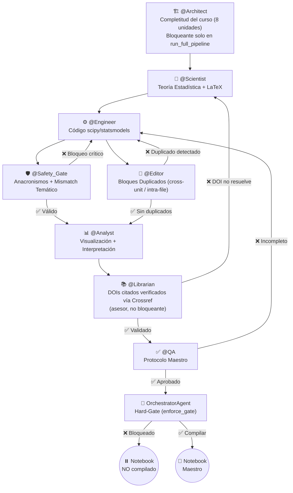

# Probabilidad y Estadística Inferencial — Agentic Core 🔬📊

[](https://www.python.org/downloads/release/python-3110/)
[](LICENSE)
[](#sistema-de-agentes-y-gobernanza)
[](#)
[](tests/)

Repositorio oficial y núcleo agéntico para la asignatura de **Probabilidad y Estadística Inferencial** de la **Ingeniería en Inteligencia Artificial y Nanotecnología** en la **Universidad de La Ciénega del Estado de Michoacán de Ocampo (UCEMICH)**.

---

## 📌 Tabla de Contenidos

1. [Visión General del Curso](#visión-general-del-curso)
2. [Uso Crítico de IA en este Curso](#uso-crítico-de-ia-en-este-curso)
3. [Estructura del Repositorio](#estructura-del-repositorio)
4. [Mapa Curricular de Unidades](#mapa-curricular-de-unidades)
5. [Sistema de Agentes y Gobernanza (El Consejo de Expertos)](#sistema-de-agentes-y-gobernanza)
6. [Instalación y Guía de Inicio Rápido](#instalación-y-guía-de-inicio-rápido)
7. [Licencia y Créditos](#licencia-y-créditos)

---

## 🔬 Visión General del Curso

Este proyecto conecta la teoría de probabilidad e inferencia estadística con aplicaciones reales en **Nanotecnología** (caracterización de nanopartículas, películas delgadas CVD, nano-sensores, simulación stocástica) y **Desarrollo de IA** (evaluación multimodelo de LLMs, análisis de residuos y pruebas de bondad de ajuste).

La **fuente de verdad** reside en las lecciones escritas en Markdown estructurado (`lecciones/*.md`), las cuales se compilan automáticamente a Jupyter Notebooks interactivos (`notebooks/*.ipynb`) siguiendo un estricto **Protocolo Maestro** de 8 componentes pedagógicos.

---

## 🧠 Uso Crítico de IA en este Curso

A diferencia de un curso de programación desde cero, en **Probabilidad y Estadística Inferencial** el uso de asistentes de IA (ChatGPT, Claude, Gemini, GitHub Copilot, `StatsTutorAgent` de este mismo repositorio, etc.) está **permitido desde la Unidad 1**, sin restricción progresiva por unidad. Esto no es una licencia para aceptar cualquier respuesta de IA sin más: es una responsabilidad explícita de **verificación crítica**.

### La regla del curso

> **Ninguna respuesta de una IA se acepta como correcta sin verificarla de forma independiente** — contra un cálculo analítico hecho a mano, contra `scipy.stats`/`sympy`, o contra una simulación numérica. Esto no es opcional ni un paso "extra": es parte del método científico que este curso enseña, y es exactamente el mismo criterio que ya aplica el ciclo Teoría → Ejemplo Analítico → Verificación Computacional de cada unidad (`lecciones/UNIDAD_*.md`) — la IA es una fuente más de hipótesis a contrastar, no un oráculo.

### Por qué esto importa específicamente en probabilidad y estadística

Los modelos de lenguaje generan texto matemático con fluidez, lo cual los hace particularmente peligrosos en esta materia: una respuesta con apariencia rigurosa (notación correcta, estructura de solución convincente) puede contener un error conceptual sutil que un alumno sin la base teórica no detectaría. Errores documentados con frecuencia en la literatura y en la práctica:

* **Confundir varianza muestral y poblacional**: una IA puede calcular $\text{Var}(X)$ usando el denominador $n$ (poblacional) cuando el problema pide la estimación insesgada con $n-1$ (corrección de Bessel, ver `UNIDAD_1_ESTADISTICA_DESCRIPTIVA.md` §1.2) — o viceversa — sin señalar la ambigüedad ni preguntar cuál corresponde.
* **Parametrizaciones inconsistentes de una misma distribución**: la Exponencial, la Gamma y la Weibull tienen al menos dos convenciones comunes cada una (tasa $\lambda$ vs. escala $\theta=1/\lambda$; forma-escala vs. forma-tasa). Una IA entrenada con material que mezcla ambas convenciones puede aplicar la fórmula de una parametrización a los parámetros de otra sin avisar, produciendo un resultado numéricamente incorrecto pero con apariencia de rigor completo.
* **Teorema de Bayes con las probabilidades invertidas**: es común que una IA calcule $P(B\mid A)$ cuando el problema pide $P(A\mid B)$ (o aplique la Regla de la Probabilidad Total con una partición que no suma 1), un error señalado explícitamente como *misconception* recurrente en `UNIDAD_2_PROBABILIDAD_COMBINATORIA.md`.
* **Redondeo prematuro en cálculos multi-paso**: una IA que resuelve "en su cabeza" (sin mostrar precisión completa en cada paso intermedio) acumula error de redondeo que puede cambiar la decisión final de una prueba de hipótesis (p. ej., un p-valor que cruza el umbral de $\alpha=0.05$ solo por el redondeo intermedio).

### Cómo verificar en la práctica

Cada unidad de este curso ya provee las herramientas para esa verificación, sin necesitar nada externo:

1. **Cálculo analítico a mano** (Sección "Ejemplo Analítico Paso a Paso" de cada unidad) — el estándar de referencia.
2. **Verificación simbólica con SymPy** (Sección "Código de Verificación Simbólica") — confirma el álgebra sin ambigüedad de redondeo.
3. **Verificación computacional con `scipy.stats`/`statsmodels`** (Sección "Solución Computacional") — la fuente de verdad numérica del curso.
4. **`StatsTutorAgent`** (Sección "Herramientas de esta Unidad" de cada lección) — a diferencia de un asistente de IA genérico, este tutor cita el contenido exacto de la unidad y hace una pregunta socrática ante un error conceptual común en vez de simplemente dar la respuesta; sigue siendo IA, y su salida también debe contrastarse contra los pasos 1-3 cuando el resultado sea crítico para una entrega.

Si una respuesta de IA (de cualquier herramienta) no coincide con al menos uno de estos tres caminos de verificación independientes, el criterio del curso es simple: **la IA está equivocada, no el cálculo manual**, hasta que se demuestre lo contrario paso a paso.

---

## 📁 Estructura del Repositorio

```
PROBABILIDAD Y ESTADÍSTICA/
├── README.md                           ← Documento principal del repositorio
├── GOVERNANCE.md                       ← Modelo de gobernanza del Consejo de 8 Expertos
├── PROTOCOLO_MAESTRO.md                ← Estándar de calidad de 8 componentes obligatorios
├── CLAUDE.md                           ← Instrucciones de desarrollo para AI Assistants
├── RUBRICA_GENERAL.md                  ← Rúbrica cuantitativa de prácticas y laboratorios
├── CHEATSHEET_PYTHON_ESTADISTICA.md    ← Referencia rápida de SciPy, Statsmodels, Seaborn
├── environment.yml                     ← Configuración del entorno Conda (ia_stats)
├── requirements.txt                    ← Fallback de dependencias Pip
├── conftest.py                         ← Configuración de rutas para pytest
│
├── lecciones/                          ← FUENTE DE VERDAD (Markdown estructurado)
│   ├── UNIDAD_1_ESTADISTICA_DESCRIPTIVA.md
│   ├── UNIDAD_2_PROBABILIDAD_COMBINATORIA.md
│   ├── UNIDAD_3_VARIABLES_ALEATORIAS_DISCRETAS.md
│   ├── UNIDAD_4_DISTRIBUCIONES_CONJUNTAS.md
│   ├── UNIDAD_5_VARIABLES_ALEATORIAS_CONTINUAS.md
│   ├── UNIDAD_6_MODELADO_SIMULACION.md
│   ├── UNIDAD_7_INFERENCIA_ESTIMACION.md
│   └── UNIDAD_8_PROYECTO_INTEGRADOR.md
│
├── notebooks/                          ← Notebooks compilados automáticamente (8 unidades, mismo nombre que su .md)
│
├── src/
│   └── multiagent_core/                ← Arquitectura Agéntica (Auditoría + Consejo)
│       ├── notebook_compiler_agent.py
│       ├── code_auditor_agent.py
│       ├── content_auditor_agent.py
│       ├── evaluator_agent.py
│       ├── orchestrator_agent.py       ← Hard-gate de compilación (enforce_gate)
│       ├── pedagogical_pipeline.py
│       ├── stats_tutor_agent.py
│       ├── pipeline.py
│       └── council/                    ← El Consejo de Expertos
│           ├── architect_agent.py
│           ├── scientist_agent.py
│           ├── engineer_agent.py
│           ├── safety_gate_agent.py    ← Anacronismos curriculares + mismatch temático
│           ├── layout_editorial_agent.py  ← Detección de bloques duplicados
│           ├── analyst_agent.py
│           ├── librarian_agent.py
│           └── qa_agent.py
│
├── external_skills/                    ← Módulos reusables de habilidades
│   ├── pedagogy/
│   ├── evaluation/
│   ├── orchestration/
│   └── numerical/
│
├── scripts/
│   ├── run_pedagogical_editorial_autofix.py  ← Auto-corrección editorial + recompilación (entry-point activo)
│   └── legacy/                         ← Scripts de un solo uso del proceso de corrección de contenido
├── tests/                              ← Suite de pruebas automáticas (Pytest)
├── docs/                               ← Documentación y auditoría de notebooks
├── data/                               ← Datasets (Nanopartículas Meta-Analysis)
└── latex/                              ← Documentos y exámenes en LaTeX
```

---

## 🗺️ Mapa Curricular de Unidades

| Unidad | Título | Temas Clave | Ecosistema Tecnológico |
|---|---|---|---|
| **U1** | Estadística Descriptiva y EDA | Media, mediana, varianza, IQR, asimetría, curtosis, KDE | Pandas, Seaborn, SciPy |
| **U2** | Probabilidad y Combinatoria | Axiomas de Kolmogorov, conjuntos, combinatoria, Bayes | SymPy, SciPy stats |
| **U3** | Variables Aleatorias Discretas | PMF, CDF, Binomial, Poisson, Geométrica, Hipergeométrica | SymPy, SciPy.stats |
| **U4** | Distribuciones Conjuntas | PMF/PDF conjunta, marginal, condicional, covarianza, PCA | SymPy, Seaborn, NumPy |
| **U5** | Variables Aleatorias Continuas | PDF, CDF, Normal, Exponencial, Gamma, Weibull | SciPy.stats, Matplotlib |
| **U6** | Modelado y Simulación | Transformada inversa, aceptación-rechazo, Monte Carlo | NumPy, SciPy.stats |
| **U7** | Inferencia y Prueba de Hipótesis | Error Tipo I/II, Neyman-Pearson, Z-test, t-test, $\chi^2$ | SciPy.stats, Statsmodels |
| **U8** | Proyecto Integrador | Aplicación completa de pruebas de hipótesis | Scikit-Learn, SciPy |

---

## 🏛️ Sistema de Agentes y Gobernanza (El Consejo de Expertos)

El proyecto opera bajo la supervisión de un **Consejo de 8 Agentes** con 3 loops de retroalimentación (**L1, L2, L3**). Ver `GOVERNANCE.md` §4 para el detalle completo de qué reporte bloquea la publicación y por qué.



**Bloqueantes reales de publicación**: `@Safety_Gate`, `@Engineer`, `@Editor`, `@Scientist`, `@Analyst` (siempre), más `@Architect` (solo en `run_full_pipeline`, que conoce el curso completo). `@Librarian` y `@QA` son asesores — sus reportes se calculan y quedan disponibles, pero no bloquean el gate (detalle y motivo en `GOVERNANCE.md` §4).

**Ejemplo ejecutable de uso**: `notebooks_extra/USO_SISTEMA_MULTIAGENTE.ipynb` corre `OrchestratorAgent.run_full_pipeline()` sobre las unidades reales del curso y `StatsTutorAgent.ask()` con una pregunta temática puntual, con salida real ya guardada. No es una unidad evaluada — vive fuera de `lecciones/` y no pasa por este mismo gate. A diferencia de las unidades del curso, es **solo para uso local** (repo clonado + entorno `ia_stats` activado): no tiene badge ni celda de setup para Google Colab.

---

## 🚀 Instalación y Guía de Inicio Rápido

### 1. Clonar el repositorio y crear el entorno Conda
```bash
git clone https://github.com/Multiagent-AI-Lab/Probability-Statistics-Agentic-AI-Core.git
cd Probability-Statistics-Agentic-AI-Core

conda env create -f environment.yml
conda activate ia_stats
```

### 2. Ejecutar la suite de pruebas automáticas
```bash
pytest
```

---

## 📄 Licencia y Créditos

Desarrollado para la **UCEMICH**.  
**Profesor Titular**: Mtro. Luis José Yudico Anaya.  
Licencia MIT.
