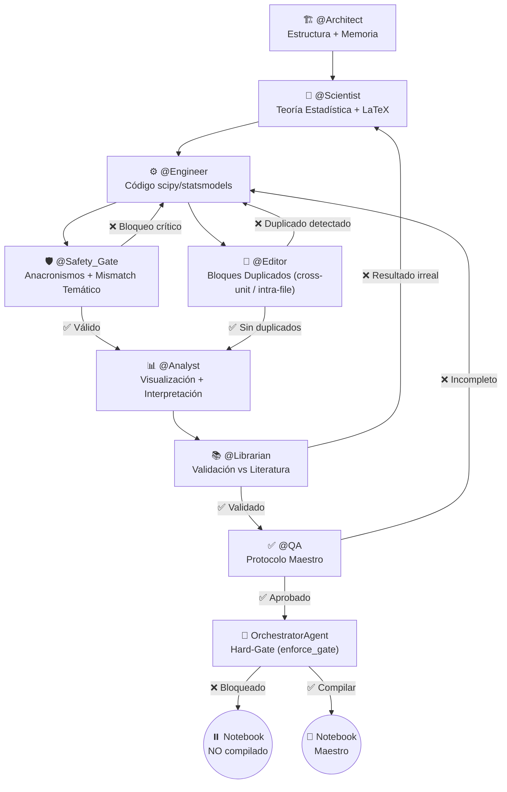

# Probabilidad y Estadística Inferencial — Agentic Core 🔬📊

[](https://www.python.org/downloads/release/python-3110/)
[](LICENSE)
[](#sistema-de-agentes-y-gobernanza)
[](#)

Repositorio oficial y núcleo agéntico para la asignatura de **Probabilidad y Estadística Inferencial** de la **Ingeniería en Inteligencia Artificial y Nanotecnología** en la **Universidad de La Ciénega del Estado de Michoacán de Ocampo (UCEMICH)**.

---

## 📌 Tabla de Contenidos

1. [Visión General del Curso](#visión-general-del-curso)
2. [Estructura del Repositorio](#estructura-del-repositorio)
3. [Mapa Curricular de Unidades](#mapa-curricular-de-unidades)
4. [Sistema de Agentes y Gobernanza (El Consejo de Expertos)](#sistema-de-agentes-y-gobernanza)
5. [Instalación y Guía de Inicio Rápido](#instalación-y-guía-de-inicio-rápido)
6. [Pipeline de Conversión Inteligente](#pipeline-de-conversión-inteligente)
7. [Licencia y Créditos](#licencia-y-créditos)

---

## 🔬 Visión General del Curso

Este proyecto conecta la teoría de probabilidad e inferencia estadística con aplicaciones reales en **Nanotecnología** (caracterización de nanopartículas, películas delgadas CVD, nano-sensores, simulación stocástica) y **Desarrollo de IA** (evaluación multimodelo de LLMs, análisis de residuos y pruebas de bondad de ajuste).

La **fuente de verdad** reside en las lecciones escritas en Markdown estructurado (`lecciones/*.md`), las cuales se compilan automáticamente a Jupyter Notebooks interactivos (`notebooks/*.ipynb`) siguiendo un estricto **Protocolo Maestro** de 8 componentes pedagógicos.

---

## 📁 Estructura del Repositorio

```
PROBABILIDAD Y ESTADÍSTICA/
├── README.md                           ← Documento principal del repositorio
├── GOVERNANCE.md                       ← Modelo de gobernanza del Consejo de 7 Expertos
├── PROTOCOLO_MAESTRO.md                ← Estándar de calidad de 8 componentes obligatorios
├── CLAUDE.md                           ← Instrucciones de desarrollo para AI Assistants
├── RUBRICA_GENERAL.md                  ← Rúbrica cuantitativa de prácticas y laboratorios
├── CHEATSHEET_PYTHON_ESTADISTICA.md    ← Referencia rápida de SciPy, Statsmodels, Seaborn
├── environment.yml                     ← Configuración del entorno Conda (ia_stats)
├── requirements.txt                    ← Fallback de dependencias Pip
├── conftest.py                         ← Configuración de rutas para pytest
│
├── lecciones/                          ← FUENTE DE VERDAD (Markdown estructurado)
│   ├── UNIDAD_1_ESTADISTICA_DESCRIPTIVA.md
│   ├── UNIDAD_2_PROBABILIDAD_COMBINATORIA.md
│   ├── UNIDAD_3_VARIABLES_ALEATORIAS_DISCRETAS.md
│   ├── UNIDAD_4_DISTRIBUCIONES_CONJUNTAS.md
│   ├── UNIDAD_5_VARIABLES_ALEATORIAS_CONTINUAS.md
│   ├── UNIDAD_6_MODELADO_SIMULACION.md
│   ├── UNIDAD_7_INFERENCIA_ESTIMACION.md
│   └── UNIDAD_8_PROYECTO_INTEGRADOR.md
│
├── notebooks/                          ← Notebooks compilados automáticamente (8 unidades, mismo nombre que su .md)
│
├── src/
│   └── multiagent_core/                ← Arquitectura Agéntica (Auditoría + Consejo)
│       ├── notebook_compiler_agent.py
│       ├── code_auditor_agent.py
│       ├── content_auditor_agent.py
│       ├── evaluator_agent.py
│       ├── orchestrator_agent.py       ← Hard-gate de compilación (enforce_gate)
│       ├── pedagogical_pipeline.py
│       ├── stats_tutor_agent.py
│       ├── pipeline.py
│       └── council/                    ← El Consejo de Expertos
│           ├── architect_agent.py
│           ├── scientist_agent.py
│           ├── engineer_agent.py
│           ├── safety_gate_agent.py    ← Anacronismos curriculares + mismatch temático
│           ├── layout_editorial_agent.py  ← Detección de bloques duplicados
│           ├── analyst_agent.py
│           ├── librarian_agent.py
│           └── qa_agent.py
│
├── external_skills/                    ← Módulos reusables de habilidades
│   ├── pedagogy/
│   ├── evaluation/
│   ├── orchestration/
│   └── numerical/
│
├── scripts/legacy/                     ← Scripts de un solo uso del proceso de corrección de contenido
├── tests/                              ← Suite de pruebas automáticas (Pytest)
├── docs/                               ← Documentación y auditoría de notebooks
├── data/                               ← Datasets (Nanopartículas Meta-Analysis)
└── latex/                              ← Documentos y exámenes en LaTeX
```

---

## 🗺️ Mapa Curricular de Unidades

| Unidad | Título | Temas Clave | Ecosistema Tecnológico |
|---|---|---|---|
| **U1** | Estadística Descriptiva y EDA | Media, mediana, varianza, IQR, asimetría, curtosis, KDE | Pandas, Seaborn, SciPy |
| **U2** | Probabilidad y Combinatoria | Axiomas de Kolmogorov, conjuntos, combinatoria, Bayes | SymPy, SciPy stats |
| **U3** | Variables Aleatorias Discretas | PMF, CDF, Binomial, Poisson, Geométrica, Hipergeométrica | SymPy, SciPy.stats |
| **U4** | Distribuciones Conjuntas | PMF/PDF conjunta, marginal, condicional, covarianza, PCA | SymPy, Seaborn, NumPy |
| **U5** | Variables Aleatorias Continuas | PDF, CDF, Normal, Exponencial, Gamma, Weibull | SciPy.stats, Matplotlib |
| **U6** | Modelado y Simulación | Transformada inversa, aceptación-rechazo, Monte Carlo | NumPy, SciPy.stats |
| **U7** | Inferencia y Prueba de Hipótesis | Error Tipo I/II, Neyman-Pearson, Z-test, t-test, $\chi^2$ | SciPy.stats, Statsmodels |
| **U8** | Proyecto Integrador | Aplicación completa de pruebas de hipótesis | Scikit-Learn, SciPy |

---

## 🏛️ Sistema de Agentes y Gobernanza (El Consejo de Expertos)

El proyecto opera bajo la supervisión de un **Consejo de 7 Agentes** con 3 loops de retroalimentación (**L1, L2, L3**):



---

## 🚀 Instalación y Guía de Inicio Rápido

### 1. Clonar el repositorio y crear el entorno Conda
```bash
git clone https://github.com/Multiagent-AI-Lab/Probability-Statistics-Agentic-AI-Core.git
cd Probability-Statistics-Agentic-AI-Core

conda env create -f environment.yml
conda activate ia_stats
```

### 2. Ejecutar la suite de pruebas automáticas
```bash
pytest
```

---

## 📄 Licencia y Créditos

Desarrollado para la **UCEMICH**.  
**Profesor Titular**: Mtro. Luis José Yudico Anaya.  
Licencia MIT.
