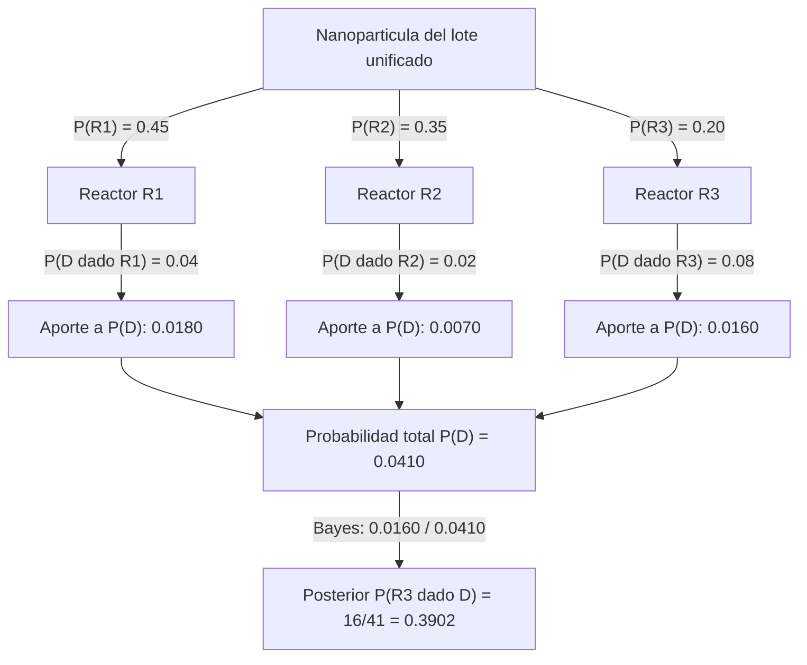

## 5. Ejemplo Analítico Paso a Paso: Clasificación Nanotecnológica de Nanopartículas

### 5.1 Contexto Aplicado en Nanotecnología
En una línea de síntesis coloidal de nanopartículas de oro (AuNPs) utilizadas para diagnóstico de biomarcadores tumorales, tres reactores químicos ($R_1$, $R_2$, $R_3$) producen el total de la producción diaria de la planta. El reactor $R_1$ sintetiza el $45\%$ de las nanopartículas, el reactor $R_2$ sintetiza el $35\%$ y el reactor $R_3$ produce el $20\%$ restante. 

Debido a ligeras variaciones de temperatura en las camisas de calefacción, el porcentaje de nanopartículas fuera de especificación de tamaño (diámetro fuera del rango óptimo de $15 \pm 2\text{ nm}$, presentando agregación coloidal) varía según el reactor de origen:
* El reactor $R_1$ produce un $4\%$ de nanopartículas defectuosas.
* El reactor $R_2$ produce un $2\%$ de nanopartículas defectuosas.
* El reactor $R_3$ produce un $8\%$ de nanopartículas defectuosas.

Si los ingenieros en nanotecnología toman una nanopartícula al azar del lote unificado al final de la jornada y, mediante microscopía electrónica de transmisión (TEM), confirman que la nanopartícula está **defectuosa** ($D$), determine la probabilidad a posteriori de que dicha nanopartícula haya sido sintetizada específicamente por el reactor $R_3$.

### 5.2 Paso 1: Definición de Eventos y Probabilidades a Priori
Sea la partición por reactores $R_1, R_2, R_3$:
$$P(R_1) = 0.45, \quad P(R_2) = 0.35, \quad P(R_3) = 0.20$$
Nótese que $P(R_1) + P(R_2) + P(R_3) = 0.45 + 0.35 + 0.20 = 1.0$.

Sea $D$ el evento: "La nanopartícula está defectuosa (fuera de especificación)".
Las verosimilitudes condicionales de defecto por reactor son:
$$P(D|R_1) = 0.04, \quad P(D|R_2) = 0.02, \quad P(D|R_3) = 0.08$$

### 5.3 Paso 2: Cálculo de la Probabilidad Total de Defecto $P(D)$
Aplicando el Teorema de la Probabilidad Total:
$$P(D) = P(D|R_1)P(R_1) + P(D|R_2)P(R_2) + P(D|R_3)P(R_3)$$
$$P(D) = (0.04 \times 0.45) + (0.02 \times 0.35) + (0.08 \times 0.20)$$
$$P(D) = 0.0180 + 0.0070 + 0.0160 = 0.0410 \quad (4.1\%)$$

### 5.4 Paso 3: Aplicación del Teorema de Bayes para $P(R_3|D)$
$$\boxed{P(R_3|D) = \frac{P(D|R_3)P(R_3)}{P(D)} = \frac{0.08 \times 0.20}{0.0410} = \frac{0.0160}{0.0410} = \frac{16}{41} \approx 0.39024}$$

**Interpretación**: Aunque el reactor $R_3$ solo sintetiza el $20\%$ del volumen total de nanopartículas, si descubrimos que una nanopartícula está defectuosa, la probabilidad de que provenga de $R_3$ se duplica casi al $39.02\%$ debido a su mayor tasa individual de defectos ($8\%$).

**Árbol de probabilidad total e inversión bayesiana**. El siguiente diagrama traza el flujo del ejemplo: desde las probabilidades a priori de cada reactor, pasando por las verosimilitudes de defecto, hasta la probabilidad total $P(D)$ que actúa como factor de normalización y la posterior $P(R_3|D)$.



### 5.5 Prueba Unitaria con pytest

Antes de reportar $P(R_3|D)\approx 0.39$ como resultado final, se verifica computacionalmente cada paso de la derivación — la partición de probabilidades a priori, la probabilidad total y el propio Teorema de Bayes — para blindar el cálculo contra errores de álgebra o de redondeo manual:

```python
import ipytest
import pytest

ipytest.autoconfig()

p_r1, p_r2, p_r3 = 0.45, 0.35, 0.20
p_d_dado_r1, p_d_dado_r2, p_d_dado_r3 = 0.04, 0.02, 0.08


def test_las_probabilidades_a_priori_de_los_reactores_suman_uno():
    assert (p_r1 + p_r2 + p_r3) == pytest.approx(1.0)


def test_probabilidad_total_de_defecto():
    p_d = p_d_dado_r1 * p_r1 + p_d_dado_r2 * p_r2 + p_d_dado_r3 * p_r3
    assert p_d == pytest.approx(0.041, rel=1e-6)


def test_teorema_de_bayes_para_r3_dado_defecto():
    p_d = p_d_dado_r1 * p_r1 + p_d_dado_r2 * p_r2 + p_d_dado_r3 * p_r3
    p_r3_dado_d = (p_d_dado_r3 * p_r3) / p_d
    assert p_r3_dado_d == pytest.approx(16 / 41, rel=1e-6)


def test_posterior_de_r3_es_mayor_que_su_prior_por_su_alta_tasa_de_defecto():
    ## R3 duplica su probabilidad al condicionar en "defectuosa": esto NO
    ## ocurriria si su tasa de defecto fuera igual al promedio del lote.
    p_d = p_d_dado_r1 * p_r1 + p_d_dado_r2 * p_r2 + p_d_dado_r3 * p_r3
    p_r3_dado_d = (p_d_dado_r3 * p_r3) / p_d
    assert p_r3_dado_d > p_r3


ipytest.run("-vv")
```

---

### 5.6 Estudio de Caso: El Problema de los Tres Prisioneros

El ejemplo de los reactores (Sección 5) resuelve Bayes en un caso donde la intuición y el cálculo coinciden. El siguiente caso clásico —isomorfo al problema de Monty Hall— es célebre precisamente porque la intuición falla: sirve para poner a prueba si el Teorema de Bayes se aplicó por comprensión o solo por sustitución mecánica en una fórmula.

**Planteamiento**: tres prisioneros, $A$, $B$ y $C$, esperan sentencia. Se sabe que exactamente uno de los tres será indultado (liberado) y los otros dos ejecutados, con probabilidad uniforme a priori:
$$P(A) = P(B) = P(C) = \frac{1}{3}$$
El prisionero $A$ le pide al guardia (que conoce el resultado, pero no puede revelárselo directamente a $A$) que le diga el nombre de **uno de los otros dos** ($B$ o $C$) que será ejecutado con certeza. El guardia responde: "$B$ será ejecutado". La pregunta es: ¿cambia esta información la probabilidad de que $A$ sea el indultado?

**Solución vía Bayes**: sea $G_B$ el evento "el guardia dice que $B$ será ejecutado". Las verosimilitudes dependen de la regla que sigue el guardia cuando tiene más de una opción válida (si $A$ es el indultado, el guardia puede decir "$B$" o "$C$" con igual probabilidad, por simetría):

$$P(G_B|A) = \frac{1}{2}, \qquad P(G_B|B) = 0, \qquad P(G_B|C) = 1$$

Nótese que estas dos últimas verosimilitudes son valores extremos (0 y 1), no intermedios: si $B$ fuera el indultado, el guardia jamás diría "$B$ será ejecutado" (sería falso); si $C$ fuera el indultado, el guardia está obligado a decir "$B$" porque es la única opción de ejecutado que no es $A$.

Aplicando el Teorema de la Probabilidad Total (§4.1):
$$P(G_B) = P(G_B|A)P(A) + P(G_B|B)P(B) + P(G_B|C)P(C) = \left(\frac{1}{2}\right)\left(\frac{1}{3}\right) + (0)\left(\frac{1}{3}\right) + (1)\left(\frac{1}{3}\right) = \frac{1}{6} + \frac{1}{3} = \frac{1}{2}$$

Y aplicando Bayes (§4.2) para cada hipótesis:
$$P(A|G_B) = \frac{P(G_B|A)P(A)}{P(G_B)} = \frac{(1/2)(1/3)}{1/2} = \frac{1}{3} \qquad P(C|G_B) = \frac{P(G_B|C)P(C)}{P(G_B)} = \frac{(1)(1/3)}{1/2} = \frac{2}{3}$$

$$\boxed{P(A|G_B) = \frac{1}{3} \text{ (no cambia)}, \qquad P(C|G_B) = \frac{2}{3} \text{ (se duplica)}}$$

**Interpretación**: la información del guardia **no cambia** la probabilidad de que $A$ sea el indultado —sigue siendo $1/3$, igual que antes de preguntar—, pero **sí concentra** la probabilidad restante casi por completo sobre $C$ ($2/3$), en vez de repartirla equitativamente entre $B$ (que ya se descartó, $P=0$) y $C$. La falacia intuitiva más común es asumir que, al eliminar a $B$ como opción, la probabilidad se reparte $50/50$ entre $A$ y $C$ — esto ignora que la respuesta del guardia no es una elección al azar entre los dos no-$A$, sino una elección **forzada** cuando $C$ es el indultado ($P(G_B|C)=1$) y solo parcialmente libre cuando $A$ lo es ($P(G_B|A)=1/2$). Esa asimetría en la verosimilitud, no en el prior, es lo que rompe la simetría aparente del resultado.

**Pregunta de reflexión**: ¿por qué el resultado sería diferente si, en cambio de pedirle al guardia que nombre a un ejecutado, $A$ pudiera *ver* directamente si $B$ fue ejecutado por una causa totalmente ajena (por ejemplo, un evento aleatorio independiente del indulto)? Piensa en qué verosimilitud $P(\text{evidencia}|A)$, $P(\text{evidencia}|B)$, $P(\text{evidencia}|C)$ correspondería a ese escenario alternativo, y si seguiría siendo asimétrica de la misma forma.

```python
## Verificacion del Problema de los Tres Prisioneros
p_a, p_b, p_c = 1/3, 1/3, 1/3

## Verosimilitudes de que el guardia diga "B sera ejecutado"
p_gb_dado_a = 1/2  ## A es el indultado: el guardia elige entre B y C al azar
p_gb_dado_b = 0    ## B es el indultado: el guardia nunca diria que B sera ejecutado
p_gb_dado_c = 1    ## C es el indultado: el guardia esta obligado a decir "B"

p_gb = p_gb_dado_a * p_a + p_gb_dado_b * p_b + p_gb_dado_c * p_c

p_a_dado_gb = (p_gb_dado_a * p_a) / p_gb
p_c_dado_gb = (p_gb_dado_c * p_c) / p_gb

print(f"P(G_B) = {p_gb:.4f}")
print(f"P(A | G_B) = {p_a_dado_gb:.4f}  (antes de preguntar: {p_a:.4f}, no cambia)")
print(f"P(C | G_B) = {p_c_dado_gb:.4f}  (antes de preguntar: {p_c:.4f}, se duplica)")
```

**Verificación simbólica (SymPy) del Problema de los Tres Prisioneros**: se expresa el Teorema de Bayes simbólicamente para $P(A|G_B)$ y $P(C|G_B)$ a partir de los priors y verosimilitudes genéricos, y solo después se sustituyen los valores concretos del problema, confirmando $P(A|G_B)=1/3$ y $P(C|G_B)=2/3$ ya publicados.

```python
import sympy as sp

## Formulas simbolicas de Bayes para A y C dado el evento G_B
p_a_s, p_b_s, p_c_s = sp.symbols('P(A) P(B) P(C)', real=True, positive=True)
p_gb_a_s, p_gb_b_s, p_gb_c_s = sp.symbols('P(G_B|A) P(G_B|B) P(G_B|C)', real=True, nonnegative=True)

## Probabilidad total simbolica de G_B (Teorema de la Probabilidad Total)
p_gb_total_s = p_gb_a_s * p_a_s + p_gb_b_s * p_b_s + p_gb_c_s * p_c_s

## Bayes simbolico para A y C dado G_B
p_a_dado_gb_simbolico = (p_gb_a_s * p_a_s) / p_gb_total_s
p_c_dado_gb_simbolico = (p_gb_c_s * p_c_s) / p_gb_total_s

## Sustitucion de los valores concretos del problema
valores = {
    p_a_s: sp.Rational(1, 3),
    p_b_s: sp.Rational(1, 3),
    p_c_s: sp.Rational(1, 3),
    p_gb_a_s: sp.Rational(1, 2),
    p_gb_b_s: 0,
    p_gb_c_s: 1,
}

resultado_a = p_a_dado_gb_simbolico.subs(valores)
resultado_c = p_c_dado_gb_simbolico.subs(valores)

print(f"P(A|G_B) simbolico evaluado: {resultado_a} (coincide con 1/3: {resultado_a == sp.Rational(1, 3)})")
print(f"P(C|G_B) simbolico evaluado: {resultado_c} (coincide con 2/3: {resultado_c == sp.Rational(2, 3)})")
```

---

* Chien, C.-F., Hsu, S.-C. & Chen, Y.-J. (2023). Bayesian decision analysis for optimizing in-line metrology and defect inspection strategy for sustainable semiconductor manufacturing and an empirical study. *Computers & Industrial Engineering*, 186, 109421. DOI: [10.1016/j.cie.2023.109421](https://doi.org/10.1016/j.cie.2023.109421) — modelo de decisión bayesiano aplicado a inspección de defectos en manufactura de semiconductores, el mismo tipo de razonamiento (Bayes + priors por reactor) del ejemplo aplicado de esta unidad.
