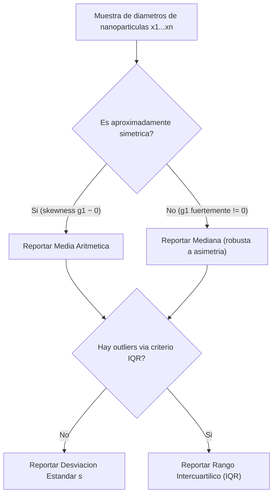

## 1. Fundamentación Teórica y Conceptos Clave

La **Estadística Descriptiva** y el **Análisis Exploratorio de Datos (EDA)** constituyen los cimientos fundamentales para caracterizar e interpretar conjuntos de datos experimentales en ciencias e ingeniería, particularmente en el estudio de sistemas nanotecnológicos y modelos de Inteligencia Artificial. El análisis descriptivo permite resumir la tendencia central, dispersión, simetría y forma de una distribución muestral mediante medidas numéricas y representaciones gráficas cuantitativas, antes de intentar cualquier modelo probabilístico o inferencia sobre la población de origen.

En esta unidad abordamos:
* Cálculo de estadísticas descriptivas cuantitativas (media, mediana, moda, varianza, desviación estándar, rango, cuantiles).
* Medidas de forma de una distribución (asimetría y curtosis).
* Análisis exploratorio visual mediante diagramas de caja (boxplots), histogramas de frecuencias y estimación de densidad de kernel (KDE).
* Aplicaciones computacionales en Python utilizando las bibliotecas `scipy.stats`, `numpy`, `pandas`, `matplotlib` y `seaborn`.

### 1.1 Medidas de Tendencia Central
Dada una muestra $x_1, x_2, \dots, x_n$, las medidas de tendencia central ubican el "centro" de los datos:

* **Media Aritmética Muestral**:
  $$\bar{x} = \frac{1}{n} \sum_{i=1}^n x_i$$
  Es sensible a valores atípicos (outliers), ya que cada observación contribuye proporcionalmente a la suma total.
* **Mediana**: el valor que divide a los datos ordenados en dos mitades iguales. Si $n$ es impar, es el valor central; si $n$ es par, es el promedio de los dos valores centrales. Es robusta ante outliers.
* **Moda**: el valor (o valores) que ocurre con mayor frecuencia. Es la única medida de tendencia central aplicable a datos categóricos.

### 1.2 Medidas de Dispersión
Las medidas de dispersión cuantifican qué tan esparcidos están los datos respecto al centro:

* **Rango**: $R = x_{\max} - x_{\min}$. Es fácil de calcular pero extremadamente sensible a valores extremos.
* **Varianza Muestral** (con corrección de Bessel, $n-1$ grados de libertad, para estimador insesgado de la varianza poblacional):
  $$s^2 = \frac{1}{n-1} \sum_{i=1}^n (x_i - \bar{x})^2$$
  La resta de un grado de libertad se debe a que $\bar{x}$ ya fue estimada de la misma muestra, dejando solo $n-1$ desviaciones independientes.
* **Desviación Estándar Muestral**: $s = \sqrt{s^2}$, en las mismas unidades que los datos originales (a diferencia de la varianza, que está en unidades al cuadrado).
* **Cuantiles y Percentiles**: el cuantil $q$ (o percentil $100q$) es el valor $x_q$ tal que una proporción $q$ de los datos es menor o igual a él. Los **cuartiles** $Q_1$ (percentil 25), $Q_2$ (percentil 50, la mediana) y $Q_3$ (percentil 75) dividen los datos en cuatro partes iguales.
* **Rango Intercuartílico (IQR)**:
  $$IQR = Q_3 - Q_1$$
  Mide la dispersión del 50% central de los datos y es robusto ante outliers; se usa además como criterio estándar de detección de valores atípicos: un dato se considera atípico si cae fuera de $[Q_1 - 1.5 \cdot IQR,\ Q_3 + 1.5 \cdot IQR]$.

### 1.3 Medidas de Forma
* **Asimetría (Skewness)**: mide la falta de simetría de la distribución respecto a su media.
  $$g_1 = \frac{\frac{1}{n}\sum_{i=1}^n (x_i - \bar{x})^3}{s^3}$$
  $g_1 > 0$ indica cola derecha más larga (asimetría positiva); $g_1 < 0$ indica cola izquierda más larga (asimetría negativa); $g_1 \approx 0$ sugiere simetría aproximada.
* **Curtosis (Kurtosis)**: mide qué tan "apuntada" o "achatada" es la distribución respecto a una normal, es decir, el peso relativo de sus colas.
  $$g_2 = \frac{\frac{1}{n}\sum_{i=1}^n (x_i - \bar{x})^4}{s^4} - 3$$
  La resta de 3 define el **exceso de curtosis**, de modo que una distribución normal tiene $g_2 = 0$. $g_2 > 0$ (leptocúrtica) indica colas más pesadas que la normal; $g_2 < 0$ (platicúrtica) indica colas más ligeras.

El siguiente diagrama resume el flujo de decisión completo de las secciones 1.1 y 1.2: qué medida de tendencia central y qué medida de dispersión reportar, según la forma de la muestra y la presencia de valores atípicos (el criterio de outlier vía IQR se detalla en la Sección 2.4 con la muestra real de nanopartículas de oro):

### 1.4 Visualización Exploratoria
* **Histograma**: agrupa los datos en intervalos (bins) y grafica la frecuencia (o densidad) de cada uno; es la herramienta más directa para intuir la forma de la distribución subyacente.
* **Diagrama de Caja (Boxplot)**: representa gráficamente $Q_1$, la mediana, $Q_3$, los bigotes (hasta $1.5 \cdot IQR$) y los outliers como puntos individuales; es ideal para comparar la dispersión entre varios grupos.
* **Estimación de Densidad de Kernel (KDE)**: una versión suavizada del histograma que estima la función de densidad de probabilidad subyacente sin asumir una forma paramétrica, sumando "kernels" (típicamente gaussianos) centrados en cada observación.

### 1.5 Los Cinco Grandes Problemas de la Estadística

La Estadística, como disciplina, no se agota en resumir un conjunto de datos: el análisis descriptivo de esta Unidad 1 es solo la primera de cinco direcciones que estructuran todo el curso. Antes de continuar, conviene ubicar dónde encaja cada herramienta futura dentro de un mapa conceptual completo — sin resolver todavía ninguno de los problemas 2 a 5, para los cuales aún no se cuenta con las herramientas necesarias:

1. **Problema de Representación de Datos**: ¿cómo resumir y visualizar un conjunto de observaciones de forma que revele su estructura (centro, dispersión, forma, valores atípicos)? Es exactamente el problema que resuelve **esta misma Unidad 1**, mediante las medidas descriptivas y la visualización exploratoria de las secciones 1.1-1.4 y 6.

2. **Problema de Ajuste de la Distribución a los Datos**: dado que los datos son una muestra de un proceso aleatorio subyacente, ¿qué modelo probabilístico (Binomial, Poisson, Normal, Exponencial, Gamma, ...) describe mejor ese proceso? Se aborda en las **Unidades 2 a 5**, que desarrollan las familias de distribuciones discretas y continuas y sus criterios de ajuste.

3. **Problema de Estimación de Parámetros**: una vez elegida una familia de distribuciones, ¿cuál es el mejor valor puntual (o el mejor intervalo) para sus parámetros desconocidos a partir de la muestra? Se aborda en la **Unidad 7** (Inferencia y Estimación), con el Método de los Momentos (§1.9) y la Estimación de Máxima Verosimilitud — MLE (§6.2-6.3).

4. **Problema de Contraste de Afirmaciones sobre la Población**: ¿los datos observados son consistentes con una afirmación específica sobre la población (una media, una proporción, la igualdad entre dos grupos), o la evidencia es suficiente para rechazarla? Se aborda también en la **Unidad 7**, con el marco completo de contrastes paramétricos (Z-test, t-test, §1.1-1.8) y no paramétricos (Kolmogorov-Smirnov, Mann-Whitney-Wilcoxon, Kruskal-Wallis, Signos y Mediana, §1.10-1.11).

5. **Problema de Correlación y Regresión**: ¿existe una relación estadística entre dos o más variables, y puede esa relación usarse para predecir una a partir de la otra? Se aborda en la **Unidad 8** (Proyecto Integrador), sección "Regresión Lineal y Correlación" (§7), que cubre desde el coeficiente de correlación de Pearson y la regresión por mínimos cuadrados (§7.1-7.2) hasta la correlación de rango, la correlación múltiple/parcial y los diagnósticos de regresión (§7.3-7.7).

Este mapa no es una curiosidad académica: cada vez que se enfrente un conjunto de datos nuevo, identificar primero *cuál* de estos cinco problemas se está resolviendo evita aplicar la herramienta equivocada (por ejemplo, calcular solo estadística descriptiva cuando la pregunta real exige contrastar una afirmación sobre la población).

Esta unidad, como el resto del curso, sigue el **Ciclo de Verificación Triple** documentado en `GOVERNANCE.md`: Teoría → Verificación Simbólica (SymPy) → Solución Computacional (SciPy) → Interpretación. La Sección 2 desarrolla el ejemplo aplicado, la Sección 3 lo verifica simbólicamente, y la Sección 4 reproduce el resultado con las herramientas de producción.

---

## 2. Ejemplo Analítico Paso a Paso: Caracterización de Nanopartículas de Oro Sintetizadas
