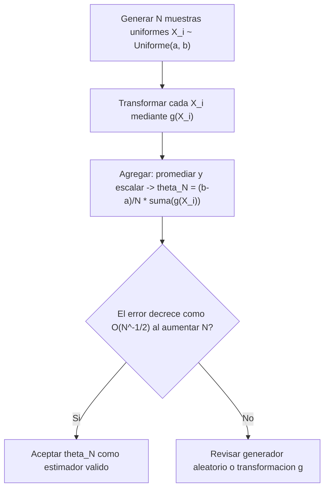

### 1.1 Números Seudoaleatorios y Generación Uniforme
La piedra angular de toda simulación Monte Carlo es el generador de números seudoaleatorios distribuido uniformemente $U \sim \text{Uniforme}(0, 1)$. Aunque las computadoras deterministas no pueden generar aleatoriedad pura sin hardware cuántico, los **Generadores Congruenciales Lineales (LCG)** y el algoritmo **Mersenne Twister (MT19937)** producen secuencias de enteros $X_n$ mediante recurrencias del tipo:

$$X_{n+1} = (a X_n + c) \pmod m$$

Donde $a$ es el multiplicador, $c$ el incremento, $m$ el módulo y $X_0$ la semilla (seed). Al dividir $U_n = \frac{X_n}{m}$, se obtiene una aproximación computacionalmente rápida a variables continuas independientes e idénticamente distribuidas en el intervalo $(0, 1)$.

### 1.2 Métodos de Generación de Variables Aleatorias Continuas y Discretas
Para transformar variables aleatorias uniformes $U \sim \text{Uniforme}(0, 1)$ en variables con distribuciones de probabilidad arbitrarias $F(x)$, se emplean tres métodos principales:

1. **Método de la Transformada Inversa**:
   Basado en el principio de que si $X$ tiene una función de distribución acumulada (CDF) continua y estrictamente creciente $F(x)$, entonces la variable $U = F(X)$ sigue una distribución $\text{Uniforme}(0, 1)$. Por lo tanto, si $U \sim \text{Uniforme}(0, 1)$, la variable transformada:
   $$\boxed{X = F^{-1}(U)}$$
   posee exactamente la CDF $F(x)$. Este método es ideal para distribuciones con función cuantil cerrada como la Exponencial, Weibull, Uniforme y Cauchy.

2. **Método de Aceptación-Rechazo (von Neumann)**:
   Utilizado cuando la CDF inversa $F^{-1}(u)$ no posee forma analítica cerrada (p. ej., distribuciones Gamma, Beta o Normal). Sea $f(x)$ la densidad objetivo deseada y $g(x)$ una densidad propuesta accesible de la cual sabemos simular muestras, tal que existe una constante $c \ge 1$ con $f(x) \le c \cdot g(x)$ para todo $x$. El algoritmo procede así:
   - Generar $Y \sim g(y)$ y $U \sim \text{Uniforme}(0, 1)$ de forma independiente.
   - Si $U \le \frac{f(Y)}{c \cdot g(Y)}$, **aceptar** $X = Y$.
   - De lo contrario, **rechazar** $Y$ y repetir la iteración.
   La eficiencia del algoritmo es $\frac{1}{c}$, por lo que se busca minimizar la envolvente $c$.

3. **Método de Box-Muller para Variables Normales**:
   Genera pares de variables aleatorias normales estándar independientes $Z_1, Z_2 \sim \mathcal{N}(0, 1)$ a partir de dos variables uniformes $U_1, U_2 \sim \text{Uniforme}(0, 1)$ mediante transformación a coordenadas polares:
   $$Z_1 = \sqrt{-2 \ln U_1} \cos(2\pi U_2), \quad Z_2 = \sqrt{-2 \ln U_1} \sen(2\pi U_2)$$

### 1.3 Métodos de Monte Carlo e Integración Estocástica
La integración por Monte Carlo evalúa integrales definidas multidimensionales mediante la aproximación del valor esperado de un estimador estocástico. Sea la integral $\theta = \int_a^b g(x) dx$, la cual puede reescribirse como $\theta = (b-a) \mathbb{E}[g(X)]$ con $X \sim \text{Uniforme}(a, b)$. El estimador de Monte Carlo con $N$ réplicas es:

$$\hat{\theta}_N = \frac{b-a}{N} \sum_{i=1}^N g(X_i)$$

Por el Teorema del Límite Central, el error de estimación decrece con orden $\mathcal{O}(N^{-1/2})$, **independientemente de la dimensión del espacio de integración**, lo que convierte a Monte Carlo en el único método ejecutable para problemas de física estadística y aprendizaje profundo en alta dimensión.

El siguiente diagrama resume el proceso general de una simulación de Monte Carlo, instanciado con el estimador $\hat{\theta}_N$ de la ecuación anterior:



### 1.4 Demostración Práctica: Implementación Directa del Generador Congruencial Lineal

La recurrencia $X_{n+1} = (a X_n + c) \pmod m$ es la piedra angular de los generadores seudoaleatorios modernos. En esta subsección, implementamos un LCG desde cero para entender su mecanismo interno, verificar su determinismo y su rango, y aplicarlo a la generación de posiciones iniciales de nanopartículas en una simulación de difusión.

#### Implementación Base del LCG

```python
def lcg(seed: int, a: int, c: int, m: int, n: int) -> list[int]:
    """
    Generador Congruencial Lineal: X_{n+1} = (a*X_n + c) mod m.
    
    Parámetros:
    -----------
    seed : int
        Semilla inicial X_0.
    a : int
        Multiplicador (debe garantizar período máximo).
    c : int
        Incremento (generalmente coprimo con m).
    m : int
        Módulo (determina el rango [0, m)).
    n : int
        Número de valores a generar.
    
    Retorna:
    --------
    list[int]
        Secuencia de n enteros seudoaleatorios en [0, m).
    """
    valores = []
    x = seed
    for _ in range(n):
        x = (a * x + c) % m
        valores.append(x)
    return valores

## Demostración numérica con parámetros del RANDU (generador histórico educativo)
secuencia = lcg(seed=7, a=1103515245, c=12345, m=2**31, n=10)
print("Secuencia LCG generada:", secuencia)

## Verificar que todos los valores están en el rango [0, m)
m = 2**31
todos_en_rango = all(0 <= v < m for v in secuencia)
print(f"Todos los valores en [0, {m}):", todos_en_rango)

## Verificar determinismo: misma semilla produce la misma secuencia
secuencia_2 = lcg(seed=7, a=1103515245, c=12345, m=2**31, n=10)
determinístico = secuencia == secuencia_2
print("¿Determinístico (misma semilla)?:", determinístico)

## Normalizar a [0, 1) dividiendo por m
secuencia_normalizada = [x / m for x in secuencia]
print("Primeros 5 valores normalizados a (0, 1):", secuencia_normalizada[:5])
```

**Salida esperada:**
```
Secuencia LCG generada: [1282168116, 642666333, 712265938, 1486001571, 2131988640, 220562521, 2099423262, 2083449087, 523310796, 715197717]
Todos los valores en [0, 2147483648): True
¿Determinístico (misma semilla)?: True
Primeros 5 valores normalizados a (0, 1): [0.5970560554414988, 0.29926483193412423, 0.3316746735945344, 0.6919734044931829, 0.9927845746278763]
```
