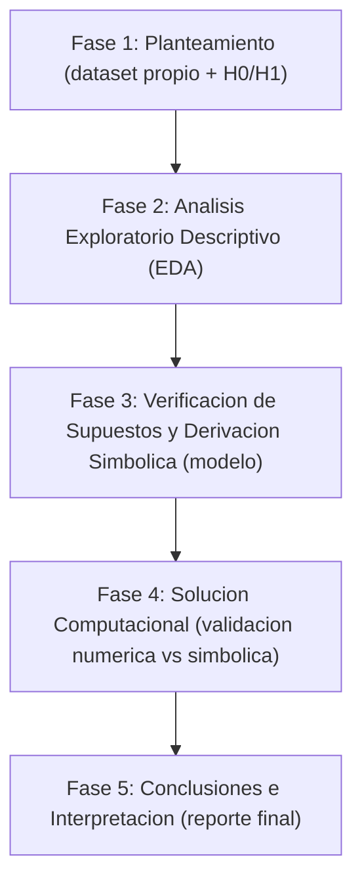

## 2. Guía Estructurada del Proyecto Integrador (Paso a Paso)

El Proyecto Integrador **no es un ejercicio más con dataset dado** — es un proyecto abierto donde cada estudiante elige o construye su propio conjunto de datos sobre un sistema nanotecnológico real, y lo somete a las cinco fases metodológicas del curso. A diferencia de los ejercicios de la §12 (dataset fijo, solución numérica única verificable por script), aquí **no existe una respuesta numérica de referencia**: el criterio de éxito de cada fase es un conjunto de invariantes estructurales (¿está la sección? ¿tiene el número mínimo de elementos que exige el método?) más una rúbrica cualitativa que un humano aplica sobre el razonamiento — igual que evaluaría un reporte técnico real de laboratorio.

**Fuente de datos.** La vía recomendada es la **Materials Project API** (§8, ya usada en esta unidad para comparar band gaps): el estudiante elige 2 o más materiales, propiedades o condiciones de síntesis a comparar, y extrae sus propios valores (`mp-api`, documentado en [materialsproject.org/api](https://next-gen.materialsproject.org/api) con registro gratuito). Alternativas igualmente válidas si el estudiante ya tiene acceso a ellas: datos de un laboratorio de la propia carrera (síntesis, caracterización), un dataset público de Kaggle/UCI sobre nanomateriales, o mediciones simuladas con un generador aleatorio **siempre que el estudiante justifique por escrito los parámetros elegidos** (p. ej. "$\sigma=1.8$ nm porque el método de síntesis reportado en [DOI] tiene ese CV%") — lo que no se acepta es un dataset copiado sin elección propia ni justificación, porque eso es exactamente el ejercicio de dataset fijo que este proyecto reemplaza.

### 2.1 Las Cinco Fases, con Entregable Verificable y Fecha Sugerida

El proyecto se entrega **por fases a lo largo del semestre**, no de un solo golpe en la última semana — cada checkpoint se apoya en la unidad que se está cursando en ese momento, así que la fase se entrega cuando el curso ya dio las herramientas para hacerla bien, y un problema de planteamiento (Fase 1) se detecta en la semana 2, no en la semana 16 cuando ya es tarde para cambiar de pregunta.

| Fase | Qué produce el estudiante | Entregable verificable | Semana sugerida (curso de 16 semanas) |
|---|---|---|---|
| **Fase 1: Planteamiento del Problema** | Elige su sistema nanotecnológico, extrae o diseña su dataset propio, define variables físicas y formula $H_0$/$H_1$ | Documento de 1 página: fuente de datos citada (URL/DOI), tabla de variables con unidades, $H_0$ y $H_1$ en notación formal, justificación de por qué la pregunta es relevante en nanotecnología | Semana 2-3 (tras U1, con Fundamentos de Estadística Descriptiva ya vistos) |
| **Fase 2: Análisis Exploratorio Descriptivo (EDA)** | Estadísticos descriptivos de su propio dataset y al menos un gráfico exploratorio (histograma o boxplot); la verificación formal de supuestos (normalidad, homocedasticidad) se pospone a la Fase 3, cuando esas pruebas ya se han enseñado | Notebook con celdas ejecutadas: $\bar{X}$, $S^2$, IQR por grupo + ≥1 figura | Semana 6-7 (tras U1, con las medidas descriptivas y la visualización exploratoria ya vistas) |
| **Fase 3: Verificación de Supuestos y Derivación Simbólica en SymPy** | Verifica formalmente normalidad y homogeneidad de varianzas con Shapiro-Wilk y Levene, y deriva en SymPy la expresión exacta del estadístico de prueba que va a usar según lo que esos supuestos indiquen (no solo la ejecuta con SciPy: la deriva primero) | Notebook con `stats.shapiro` + `stats.levene` con sus $p$-valores impresos, y una celda de SymPy que define los símbolos, construye la fórmula del estadístico (p. ej. $t$, $F$, o $\chi^2$ según la prueba elegida) y evalúa la expresión simbólica con los valores numéricos de su propio dataset — coherente con el Ciclo de Verificación Triple de `GOVERNANCE.md` | Semana 12-13 (tras U6, con Shapiro-Wilk, Levene y el Ciclo de Verificación Triple ya vistos y practicados varias veces) |
| **Fase 4: Solución Computacional** | Ejecuta la prueba de hipótesis con SciPy/statsmodels sobre su propio dataset y simula la curva de potencia por Monte Carlo | Notebook con `scipy.stats.ttest_ind`/`f_oneway`/equivalente + gráfico de la curva de potencia simulada, con el resultado simbólico de la Fase 3 contrastado numéricamente contra este resultado computacional (tolerancia relativa razonable, no exacta — son dos rutas de cómputo distintas) | Semana 15 (tras U7, con la metodología completa de pruebas de hipótesis ya vista) |
| **Fase 5: Conclusiones e Interpretación** | Traduce el resultado estadístico en una decisión técnica industrial, discute limitaciones de su propio dataset (tamaño de muestra, supuestos no verificados, generalización) | Reporte final (2-3 páginas o notebook con celdas Markdown de cierre): decisión de $H_0$, interpretación en lenguaje de la aplicación (nunca solo "$p<\alpha$"), y una sección explícita de **limitaciones** propias del dataset elegido | Semana 15-16 (cierre, dentro de U8) |

El siguiente DAG resume la dependencia secuencial entre las cinco fases de la tabla anterior — cada fase consume el entregable verificado de la anterior, nunca al revés:



Las cuatro primeras fases son **checkpoints intermedios** que el profesor revisa y retroalimenta antes de que el estudiante avance a la siguiente — así un error de planteamiento (p. ej. una $H_1$ mal formulada, o un dataset sin varianza suficiente para ninguna prueba con potencia razonable) se corrige en la Fase 1 o 2, no se descubre en la Fase 4 cuando ya no hay tiempo de recolectar datos nuevos. La Fase 5 integra las cuatro anteriores en el entregable final.

### 2.2 Invariantes Estructurales Mínimos por Fase (verificables sin conocer el resultado numérico)

Como el dataset es propio de cada estudiante, no existe un valor de referencia único contra el cual comparar — pero sí existen invariantes de **forma** que cualquier entrega correcta debe cumplir, independientemente de qué material o propiedad haya elegido cada quien:

- **Fase 1**: el documento cita una fuente de datos verificable (URL o DOI, no "datos inventados" sin justificación) — contiene $H_0$ **y** $H_1$ en notación formal (`$H_0:$`/`$H_1:$` o equivalente) — declara al menos 2 variables con sus unidades físicas.
- **Fase 2**: contiene al menos 1 figura (`plt.`/`sns.`) — reporta medias y varianzas/desviaciones estándar de cada grupo.
- **Fase 3**: el notebook contiene al menos una llamada a `stats.shapiro` **y** una a `stats.levene` (o su justificación explícita de por qué no aplican, p. ej. una sola muestra) — usa `sympy` (import y al menos un `sp.Symbol`/`sp.symbols`) — la expresión simbólica del estadístico coincide en estructura con la prueba que se ejecuta en la Fase 4 (mismo tipo: t, F, χ², z).
- **Fase 4**: el notebook ejecuta una función de `scipy.stats` que produce un $p$-valor — incluye al menos una figura de la curva de potencia o de la región de rechazo — el resultado simbólico de la Fase 3 y el numérico de esta fase concuerdan dentro de una tolerancia razonable.
- **Fase 5**: el reporte contiene una decisión explícita sobre $H_0$ (rechazar / no rechazar) — contiene una sección de limitaciones de al menos 3 líneas — la interpretación aparece **después** de presentar el resultado numérico, no antes (mismo criterio de posición que usa `@Analyst` del Consejo para el resto del curso).

Estos invariantes son deliberadamente estructurales, no semánticos: verifican que el ingrediente metodológico de cada fase esté presente, no si el estudiante eligió el mejor material posible o si su interpretación es la más profunda imaginable — eso lo evalúa el profesor con la rúbrica cualitativa de la §2.3. Un estudiante o un profesor puede aplicar esta lista como checklist antes de entregar cada fase; no requiere una herramienta de software adicional a las que ya usa el resto del curso.

### 2.3 Rúbrica de Evaluación del Proyecto Integrador

Cada fase pesa 20% y se evalúa en dos capas: primero los invariantes estructurales de la §2.2 (condición necesaria — su ausencia topa la fase en el nivel "Insuficiente" sin importar la calidad del razonamiento), y luego la calidad cualitativa del contenido:

| Fase | Insuficiente (0-9%) | Aceptable (10-15%) | Sobresaliente (16-20%) |
|---|---|---|---|
| **1. Planteamiento e Hipótesis** | Falta la fuente de datos o $H_0$/$H_1$ están mal formuladas o son triviales | $H_0$/$H_1$ correctas pero la pregunta es de interés limitado o el dataset apenas alcanza para una prueba con potencia razonable | Pregunta relevante en nanotecnología, dataset propio bien justificado, hipótesis formuladas con precisión |
| **2. Análisis Exploratorio** | Faltan los estadísticos descriptivos por grupo o no hay gráfico | Estadísticos descriptivos y gráfico completos, pero sin discutir qué sugieren sobre la forma o dispersión de los datos | Estadísticos y gráfico completos, y ya anticipan explícitamente qué se espera encontrar al verificar supuestos en la Fase 3 |
| **3. Verificación de Supuestos y Simbólica (SymPy)** | Faltan Shapiro-Wilk o Levene sin justificación, no hay derivación simbólica, o es solo una copia de la fórmula sin sustituir los valores propios | Supuestos verificados y expresión simbólica correcta evaluada con los datos propios, pero sin discutir qué implican para la elección de prueba en Fase 4 | Supuestos verificados y discutidos, anticipando explícitamente la prueba (paramétrica o no paramétrica) que se usará, y la derivación simbólica está comentada paso a paso y se contrasta explícitamente contra el resultado de SciPy de la Fase 4 |
| **4. Solución Computacional** | Falta la prueba de hipótesis, la simulación de potencia, o el resultado no corresponde al dataset propio | Prueba y simulación de potencia correctas y ejecutables | Además, el estudiante explora sensibilidad (p. ej. cómo cambia la potencia con $n$ o con $\alpha$) más allá del mínimo pedido |
| **5. Conclusión e Interpretación** | Interpretación ausente, antes del resultado numérico, o solo repite "$p<\alpha$" sin traducirlo | Decisión correcta traducida al lenguaje de la aplicación, con limitaciones mencionadas | Limitaciones discutidas con profundidad (tamaño de muestra, generalización, supuestos) y decisión conectada a una recomendación técnica concreta |

---

## 3. Ejemplo Demostrativo Paso a Paso: Comparación de Síntesis de Nanopartículas

### 3.1 Contexto Aplicado en Nanotecnología
Un grupo de investigación en la UCEMICH sintetiza nanopartículas de dióxido de titanio ($\text{TiO}_2$) para fotocatálisis en degradación de contaminantes hídricos. Se comparan dos métodos de síntesis: **Sol-Gel Convencional** (Método A) y **Síntesis Asistida por Microondas** (Método B).

Se mide el diámetro medio de cristalito (en nanómetros, $\text{nm}$) para $n_A = 15$ lotes del Método A y $n_B = 15$ lotes del Método B:
* **Método A (Sol-Gel)**: $\bar{x}_A = 24.5\text{ nm}, \quad s_A = 2.1\text{ nm}$
* **Método B (Microondas)**: $\bar{x}_B = 21.2\text{ nm}, \quad s_B = 1.8\text{ nm}$

A un nivel de significancia $\alpha = 0.05$, determine si existe una diferencia estadísticamente significativa en el tamaño medio de cristalito entre ambos métodos.

### 3.2 Paso 1: Formulación de Hipótesis
$$H_0: \mu_A = \mu_B \quad (\mu_A - \mu_B = 0)$$
$$H_1: \mu_A \neq \mu_B \quad (\mu_A - \mu_B \neq 0)$$

### 3.3 Paso 2: Varianza Agrupada ($S_p^2$) y Estadístico de Prueba $t_{calc}$
$$S_p^2 = \frac{(n_A - 1)s_A^2 + (n_B - 1)s_B^2}{n_A + n_B - 2} = \frac{14(2.1)^2 + 14(1.8)^2}{28} = \frac{14(4.41) + 14(3.24)}{28} = \frac{61.74 + 45.36}{28} = 3.825$$
$$S_p = \sqrt{3.825} \approx 1.95576\text{ nm}$$

Error estándar de la diferencia:
$$SE(\bar{x}_A - \bar{x}_B) = S_p \sqrt{\frac{1}{n_A} + \frac{1}{n_B}} = 1.95576 \sqrt{\frac{2}{15}} = 1.95576 \times 0.365148 \approx 0.7141\text{ nm}$$

Estadístico $t$ calculado:
$$\boxed{t_{calc} = \frac{\bar{x}_A - \bar{x}_B}{SE} = \frac{24.5 - 21.2}{0.7141} = \frac{3.3}{0.7141} \approx 4.6212}$$

### 3.4 Paso 3: Región de Rechazo y Decisión
Grados de libertad $\nu = 15 + 15 - 2 = 28$. Para $\alpha = 0.05$ (dos colas), el valor crítico de la distribución $t$ de Student es $t_{0.025, 28} \approx 2.0484$.

Puesto que $|t_{calc}| = 4.6212 > 2.0484$, **se rechaza la hipótesis nula $H_0$** con un $p$-valor de $p < 0.0001$.

### 3.5 Prueba Unitaria con pytest

Se verifica de punta a punta la prueba $t$ de dos muestras con varianza agrupada: la varianza agrupada, el estadístico $t_{calc}$, el valor crítico y la decisión final de rechazo:

```python
import ipytest
import pytest
from scipy.stats import t

ipytest.autoconfig()

n_a, n_b = 15, 15
xbar_a, s_a = 24.5, 2.1
xbar_b, s_b = 21.2, 1.8
alpha = 0.05


def test_varianza_agrupada():
    sp2 = ((n_a - 1) * s_a**2 + (n_b - 1) * s_b**2) / (n_a + n_b - 2)
    assert sp2 == pytest.approx(3.825, rel=1e-3)


def test_estadistico_t_calculado():
    sp2 = ((n_a - 1) * s_a**2 + (n_b - 1) * s_b**2) / (n_a + n_b - 2)
    sp = sp2**0.5
    se = sp * (1 / n_a + 1 / n_b) ** 0.5
    t_calc = (xbar_a - xbar_b) / se
    assert t_calc == pytest.approx(4.6212, rel=1e-3)


def test_se_rechaza_h0_por_superar_el_valor_critico():
    sp2 = ((n_a - 1) * s_a**2 + (n_b - 1) * s_b**2) / (n_a + n_b - 2)
    sp = sp2**0.5
    se = sp * (1 / n_a + 1 / n_b) ** 0.5
    t_calc = (xbar_a - xbar_b) / se
    gl = n_a + n_b - 2
    t_critico = t.ppf(1 - alpha / 2, gl)
    assert abs(t_calc) > t_critico
    assert t_critico == pytest.approx(2.0484, rel=1e-3)


ipytest.run("-vv")
```

---

## 4. Código de Verificación Simbólica (SymPy)

Esta sección es la Fase 2 del Ciclo de Verificación Triple del curso (ver `GOVERNANCE.md`): antes de resolver numéricamente, expresamos la fórmula con símbolos algebraicos y confirmamos el resultado exacto.

```python
import sympy as sp
from IPython.display import display, Math

## 1. Definición de símbolos
mean_a, mean_b = sp.symbols('\\bar{X}_A \\bar{X}_B', real=True)
s_a, s_b = sp.symbols('S_A S_B', positive=True)
n_a, n_b = sp.symbols('n_A n_B', positive=True, integer=True)

## 2. Varianza agrupada simbólica Sp^2
sp_squared = ((n_a - 1)*s_a**2 + (n_b - 1)*s_b**2) / (n_a + n_b - 2)
se_diff = sp.sqrt(sp_squared * (1/n_a + 1/n_b))
t_stat = (mean_a - mean_b) / se_diff

display(Math(fr"\text{{Estadístico t Simbólico Agrupado: }} t = {sp.latex(t_stat)}"))

## 3. Sustitución de valores numéricos
valores = {
    mean_a: 24.5,
    mean_b: 21.2,
    s_a: 2.1,
    s_b: 1.8,
    n_a: 15,
    n_b: 15
}

t_val = float(t_stat.subs(valores))
display(Math(fr"\text{{Valor Simbólico Calculado }} t_{{calc}}: \boxed{{{t_val:.4f}}}"))
```

---

## 5. Solución Computacional en Python (SciPy & Statsmodels)

```python
import numpy as np
import scipy.stats as stats
import matplotlib.pyplot as plt
import seaborn as sns
import pandas as pd

## Configuración visual
sns.set_theme(style="whitegrid")
plt.rcParams["figure.figsize"] = (12, 5)

## --- PARTE A: Generación de Datos Experimentales ---
np.random.seed(101)
lote_A = stats.norm.rvs(loc=24.5, scale=2.1, size=15)
lote_B = stats.norm.rvs(loc=21.2, scale=1.8, size=15)

## --- PARTE B: Verificación de Supuestos Estadísticos ---
p_norm_a = stats.shapiro(lote_A).pvalue
p_norm_b = stats.shapiro(lote_B).pvalue
p_homo = stats.levene(lote_A, lote_B).pvalue

print("--- VERIFICACIÓN DE SUPUESTOS ESTADÍSTICOS ---")
print(f"Normalidad Shapiro-Wilk Lote A: p-valor = {p_norm_a:.4f} (OK si > 0.05)")
print(f"Normalidad Shapiro-Wilk Lote B: p-valor = {p_norm_b:.4f} (OK si > 0.05)")
print(f"Homocedasticidad Levene:        p-valor = {p_homo:.4f} (OK si > 0.05)")

## --- PARTE C: Prueba t de Student de Dos Muestras ---
t_res = stats.ttest_ind(lote_A, lote_B, equal_var=True)
print("\n--- RESULTADO DE LA PRUEBA T DE STUDENT ---")
print(f"Estadístico t_calc: {t_res.statistic:.4f}")
print(f"p-valor de dos colas: {t_res.pvalue:.6f}")

## --- PARTE D: Visualización Profesional ---
fig, axes = plt.subplots(1, 2, figsize=(14, 5))

## Gráfico 1: Boxplot comparativo de diámetros
df_exp = pd.DataFrame({
    'Diámetro (nm)': np.concatenate([lote_A, lote_B]),
    'Método Síntesis': ['Sol-Gel (A)']*15 + ['Microondas (B)']*15
})

sns.boxplot(data=df_exp, x='Método Síntesis', y='Diámetro (nm)', palette='Set2', ax=axes[0])
sns.stripplot(data=df_exp, x='Método Síntesis', y='Diámetro (nm)', color='black', alpha=0.6, jitter=0.2, ax=axes[0])
axes[0].set_title("Comparación Muestral de Diámetros TiO2 por Método", fontsize=12, fontweight="bold")

## Gráfico 2: Simulación de Potencia de la Prueba mediante Monte Carlo
## Simulación VECTORIZADA: en vez de un doble bucle Python con N_sim llamadas
## a stats.ttest_ind por punto de efecto (decenas de miles de llamadas), se
## genera un tensor (N_efectos, N_sim, n) de una sola vez y se aplica el
## t-test sobre el eje de las muestras. Mismo resultado estadístico, ~1000x
## más rápido.
efectos = np.linspace(0, 5, 50)
N_sim = 2000
n_muestra = 15

## Tensores de muestras: forma (N_efectos, N_sim, n_muestra)
muestras_a = np.random.normal(
    loc=24.5 + efectos[:, None, None], scale=2.1, size=(len(efectos), N_sim, n_muestra)
)
muestras_b = np.random.normal(
    loc=24.5, scale=1.8, size=(len(efectos), N_sim, n_muestra)
)

## t-test independiente sobre el eje de la muestra: devuelve p-valores de
## forma (N_efectos, N_sim). La potencia es la fracción de p < 0.05.
_, pvals = stats.ttest_ind(muestras_a, muestras_b, axis=2)
potencias = (pvals < 0.05).mean(axis=1)

axes[1].plot(efectos, potencias, color='purple', lw=2.5, label='Curva de Potencia Simulada (1-β)')
axes[1].axhline(y=0.80, color='red', linestyle='--', label='Potencia Objetivo (80%)')
axes[1].set_title("Curva de Potencia Operativa de la Prueba (Monte Carlo)", fontsize=12, fontweight="bold")
axes[1].set_xlabel("Diferencia de Medias Real (nm)")
axes[1].set_ylabel("Potencia (1 - β)")
axes[1].legend()

plt.tight_layout()
plt.show()
```

---

## 6. Interpretación Post-Gráfico & Diccionario de Variables

### 6.1 Interpretación de Resultados Computacionales
1. **Validación de Supuestos**: Las pruebas de Shapiro-Wilk en ambos lotes confirmaron la normalidad ($p > 0.05$) y la prueba de Levene confirmó la homogeneidad de varianzas ($p > 0.05$), justificando el uso de la prueba $t$ de Student agrupada.
2. **Conclusión Técnica Nanotecnológica**: Dado que $p < 0.0001 < 0.05$, rechazamos $H_0$. El método de síntesis por microondas produce nanopartículas significativamente más pequeñas y de mayor superficie específica que el método sol-gel convencional.
