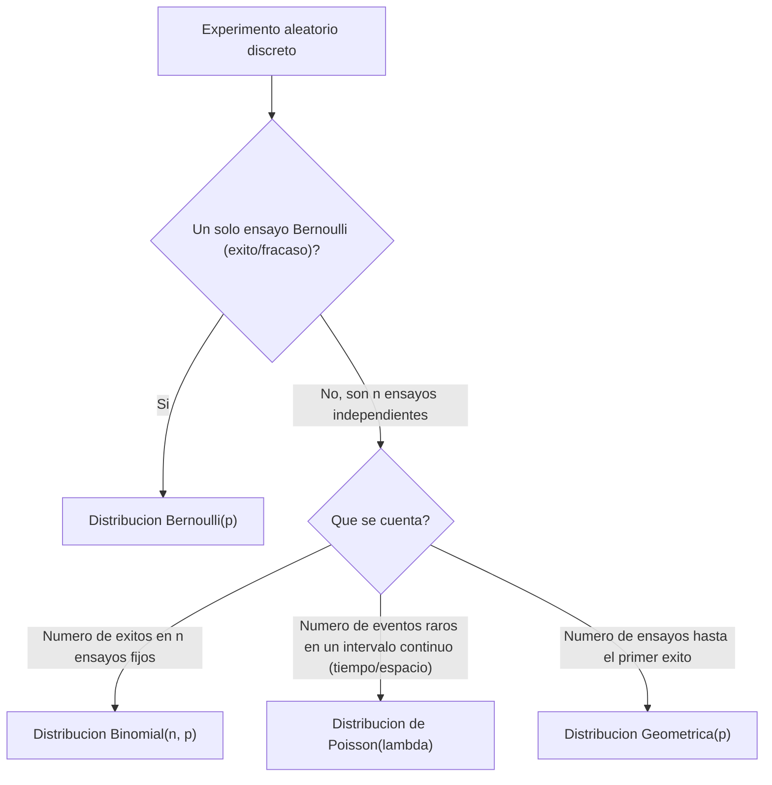

## 2. Familias Principales de Distribuciones Discretas

### 2.1 Distribución Bernoulli ($X \sim \text{Bernoulli}(p)$)
Modela un único ensayo aleatorio binario con probabilidad de éxito $p$ ($X=1$) y fracaso $q = 1-p$ ($X=0$).
* PMF: $P(X = x) = p^x (1-p)^{1-x}, \quad x \in \{0, 1\}$.
* Esperanza: $\mathbb{E}[X] = p$, Varianza: $\text{Var}(X) = p(1-p)$.

### 2.2 Distribución Binomial ($X \sim \text{Binomial}(n, p)$)
Número de éxitos en $n$ ensayos independientes e idénticamente distribuidos de Bernoulli.
* PMF:
  $$P(X = k) = \binom{n}{k} p^k (1-p)^{n-k}, \quad k \in \{0, 1, 2, \dots, n\}$$
* Esperanza: $\mathbb{E}[X] = n p$, Varianza: $\text{Var}(X) = n p (1-p)$.

### 2.3 Distribución de Poisson ($X \sim \text{Poisson}(\lambda)$)
Modela la ocurrencia de eventos raros en un intervalo continuo de tiempo o espacio, con tasa media $\lambda > 0$.
* PMF:
  $$P(X = k) = \frac{\lambda^k e^{-\lambda}}{k!}, \quad k \in \{0, 1, 2, \dots\}$$
* Esperanza: $\mathbb{E}[X] = \lambda$, Varianza: $\text{Var}(X) = \lambda$.

### 2.4 Distribución Geométrica ($X \sim \text{Geométrica}(p)$)
Número de ensayos independientes de Bernoulli hasta obtener el **primer éxito**.
* PMF: $P(X = k) = (1-p)^{k-1} p, \quad k \in \{1, 2, 3, \dots\}$.
* Esperanza: $\mathbb{E}[X] = \frac{1}{p}$, Varianza: $\text{Var}(X) = \frac{1-p}{p^2}$.

### 2.5 Distribución Binomial Negativa ($X \sim \text{BinomialNegativa}(r, p)$)
Número de fracasos $k$ antes de observar el $r$-ésimo éxito.
* PMF:
  $$P(K = k) = \binom{k + r - 1}{k} p^r (1-p)^k, \quad k \in \{0, 1, 2, \dots\}$$
* Esperanza: $\mathbb{E}[K] = \frac{r(1-p)}{p}$, Varianza: $\text{Var}(K) = \frac{r(1-p)}{p^2}$.

### 2.6 Distribución Hipergeométrica ($X \sim \text{Hipergeométrica}(N, K, n)$)
Muestreo **sin reemplazo** de una población finita $N$ que contiene $K$ elementos con la característica deseada.
* PMF:
  $$P(X = k) = \frac{\binom{K}{k} \binom{N-K}{n-k}}{\binom{N}{n}}$$

### 2.7 Distribución Uniforme Discreta ($X \sim \text{Uniforme}\{1,\dots,k\}$)
Modela un experimento donde cada uno de $k$ resultados posibles tiene exactamente la misma probabilidad de ocurrir.
* PMF: $P(X = x_i) = \dfrac{1}{k}, \quad x_i \in \{1, 2, \dots, k\}$.
* Esperanza: $\mathbb{E}[X] = \dfrac{k+1}{2}$, Varianza: $\text{Var}(X) = \dfrac{k^2-1}{12}$.

### 2.8 Distribución Multinomial ($X_1,\dots,X_k \sim \text{Multinomial}(n, p_1,\dots,p_k)$)
Generaliza la distribución Binomial a experimentos con más de dos resultados posibles por ensayo.
* PMF: $P(X_1=k_1,\dots,X_k=k_k) = \dfrac{n!}{k_1!\,k_2!\cdots k_k!}\, p_1^{k_1} p_2^{k_2} \cdots p_k^{k_k}$, con $\sum_i k_i = n$.
* Esperanza por componente: $\mathbb{E}[X_i] = np_i$, Desviación estándar: $\sigma_i = \sqrt{np_i(1-p_i)}$.

El siguiente árbol de decisión resume cómo elegir entre las cuatro familias discretas más frecuentes (2.1-2.4) según la pregunta que plantea el experimento:



### 2.9 Profundización: PMF Completa, CDF y Aplicaciones por Dominio

Las subsecciones 2.1 a 2.8 dan la definición mínima de cada familia. Esta subsección profundiza las 8 distribuciones discretas del curso con su CDF explícita, código de comparación gráfica en `scipy.stats`, y ejemplos de uso concretos en **Nanotecnología**, **Inteligencia Artificial** y **Diseño de Experimentos (DOE)**.

#### 2.9.1 Distribución Bernoulli — Profundización

* **CDF**: $F(x) = 0$ si $x<0$; $F(x) = 1-p$ si $0\le x<1$; $F(x)=1$ si $x\ge 1$.
* Caso especial de la Binomial con $n=1$: `scipy.stats.bernoulli` es un atajo de `binom(n=1, p)`.

```python
import numpy as np
import matplotlib.pyplot as plt
from scipy.stats import bernoulli

## PMF de Bernoulli: probabilidad de que un nanosensor individual
## detecte correctamente un analito en una sola prueba (p=0.7)
p = 0.7
dist = bernoulli(p)
valores = [0, 1]
probabilidades = dist.pmf(valores)

plt.figure(figsize=(6, 4))
plt.bar(valores, probabilidades, color=["lightcoral", "skyblue"], edgecolor="black")
plt.xticks(valores, ["0 (fallo)", "1 (éxito)"])
plt.title(f"PMF Bernoulli(p={p})")
plt.ylabel("Probabilidad")
plt.ylim(0, 1)
plt.show()
```

**Nota de implementación**: como `bernoulli(p)` es exactamente `binom(n=1, p)`, ambas clases de `scipy.stats` son intercambiables — es común encontrar código que usa una u otra según la fuente. El siguiente fragmento reproduce el mismo resultado del bloque anterior usando `binom` directamente, para un nanosensor que detecta la presencia de un contaminante con probabilidad $p=0.9$ de operar correctamente en una sola prueba:

```python
from scipy.stats import binom

p_exito = 0.9
x = 1  # exito: sensor no contaminado

probabilidad_pmf = binom.pmf(k=x, n=1, p=p_exito)         # equivalente a bernoulli.pmf(x, p_exito)
probabilidad_cdf = binom.cdf(k=x, n=1, p=p_exito)         # equivalente a bernoulli.cdf(x, p_exito)

print(f"P(X={x}) via binom(n=1): {probabilidad_pmf:.4f}")
print(f"F({x}) via binom(n=1):   {probabilidad_cdf:.4f}")
```

**Aplicaciones**: (1) *Nanotecnología*: resultado binario de una sola prueba de control de calidad sobre un nanodispositivo (pasa/no pasa la especificación de espesor). (2) *IA*: unidad básica de clasificación binaria — la salida de una neurona con activación sigmoide seguida de umbral se modela como Bernoulli con $p$ igual a la probabilidad predicha. (3) *DOE*: resultado de un único ensayo experimental con dos desenlaces posibles (p. ej., una réplica de síntesis produce o no el polimorfo deseado).

#### 2.9.2 Distribución Binomial — Profundización

* **CDF**: $F(x) = P(X\le x) = \sum_{i=0}^{\lfloor x\rfloor} \binom{n}{i}p^i(1-p)^{n-i}$.
* Suma de $n$ Bernoulli($p$) independientes: modela el conteo total de éxitos en un número fijo de ensayos idénticos.

```python
import numpy as np
import matplotlib.pyplot as plt
from scipy.stats import binom

## PMF Binomial: numero de nanoparticulas defectuosas en un lote de
## n=20 con probabilidad de defecto p=0.05 por particula
n, p = 20, 0.05
dist = binom(n, p)
k = np.arange(0, n + 1)

plt.figure(figsize=(8, 5))
plt.bar(k, dist.pmf(k), color="steelblue", edgecolor="black")
plt.title(f"PMF Binomial(n={n}, p={p})")
plt.xlabel("Número de defectos (k)")
plt.ylabel("Probabilidad")
plt.show()
```

**Aplicaciones**: (1) *Nanotecnología*: número de nanopartículas defectuosas en un lote de tamaño fijo bajo una tasa de defecto constante por partícula — control de calidad de síntesis. (2) *IA*: número de predicciones correctas de un clasificador binario sobre un conjunto de prueba de tamaño fijo, bajo el supuesto de accuracy constante; fundamento del intervalo de confianza binomial para accuracy reportada. (3) *DOE*: número de réplicas exitosas de un experimento (p. ej., síntesis que alcanza la pureza objetivo) de un total de $n$ réplicas planeadas, para dimensionar el tamaño de muestra necesario.

#### 2.9.3 Distribución de Poisson — Profundización

* **CDF**: $F(x) = P(X\le x) = \sum_{i=0}^{\lfloor x\rfloor} \dfrac{\lambda^i e^{-\lambda}}{i!}$.
* Límite de la Binomial cuando $n\to\infty$, $p\to 0$ con $np=\lambda$ constante — modela conteos raros en un intervalo continuo de tiempo o espacio.

```python
import numpy as np
import matplotlib.pyplot as plt
from scipy.stats import poisson

## PMF Poisson: numero de fallas de un nano-dispositivo por cada
## 1000 horas de operacion, con tasa promedio lambda=4
lam = 4
dist = poisson(lam)
k = np.arange(0, 16)

plt.figure(figsize=(8, 5))
plt.bar(k, dist.pmf(k), color="darkorange", edgecolor="black")
plt.title(f"PMF Poisson($\\lambda$={lam})")
plt.xlabel("Número de eventos (k)")
plt.ylabel("Probabilidad")
plt.show()
```
